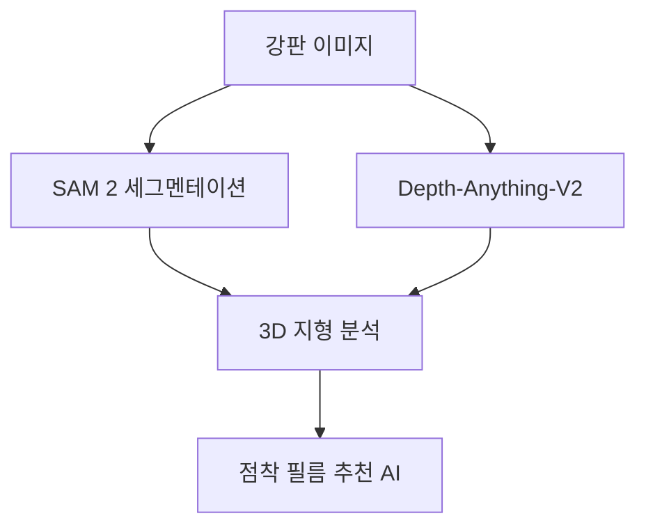

# [프로젝트 제안서] AI 기반 표면 분석 및 필름 추천

프로젝트 코드: SG_proj_007
프로젝트 별칭: SG-TERRA (Topographic Evaluation & Resin-film Recommendation AI)

[](https://github.com/HyunchanAn/SG_proj_007)
[](https://github.com/HyunchanAn/SG_proj_007)
[](https://github.com/HyunchanAn/SG_proj_007)
[](https://github.com/HyunchanAn/SG_proj_007)

## 기술 아키텍처 및 워크플로우

### 아키텍처 다이어그램


## 1. 요약
본 프로젝트는 SAM 2(Segment Anything Model 2)와 Depth-Anything-V2를 결합하여, 강판 가공 전 피착제의 3D 입체 구조(곡률, 조도, 형상)를 단안 이미지로부터 정밀 추출하고, 이를 기반으로 프레스 공정 중 들뜸이나 주름 발생을 최소화할 수 있는 최적 점착 필름 모델을 자동 추천하는 AI 솔루션 구축을 목적으로 함.

"SG-TERRA는 사진 한 장으로 강판의 굴곡을 3D로 읽어내고, 우리 회사의 어떤 필름이 가장 완벽하게 버틸 수 있는지 데이터로 답하는 AI입니다."

## 2. 저장소 개요
- 저장소 이름: SG_proj_007
- 주요 기술 스택: Python, PyTorch, SAM 2, Depth-Anything-V2, OpenCV, Streamlit
- 타겟 인프라: 온프레미스(RTX 5080) 및 클라우드(Google Antigravity)

### 🌿 브랜치 관리 정책
프로젝트의 효율적인 관리와 실험적 기능의 안정적인 분리를 위해 아래와 같이 브랜치를 운영합니다.
- `main`: [프로덕션] 단일 사진 기반의 핵심 MVP 버전입니다. 가장 안정적이며 클라우드 배포(Streamlit Cloud)에 최적화되어 있습니다.
- `feature/multi-view`: [연구] 다각도 사진을 활용한 3D 정밀 재구성 및 퓨전 기능을 포함합니다. 현재 도입 여부를 검토 중인 고도화 기능들을 독립적으로 유지하여 `main`의 안정성을 보전합니다.

현재 상태: MVP 운영 준비 완료
- Segmentation 에서 Depth, Curvature, Knowledge Engine 매칭으로 이어지는 엔드투엔드 멀티모달 파이프라인 구현 성공.
- 배경 노이즈를 완화하기 위해 사용자가 직접 ROI를 지정할 수 있는 Streamlit 기반 대시보드(app.py) 배포.
- 모바일 환경에 맞춘 인터페이스 개편.
- FastAPI 기반의 독립형 REST API 엔드포인트 연동 완료 (마이크로서비스 아키텍처).
- 로컬 MacBook Pro M2 환경의 MPS(Metal Performance Shaders)를 활용한 라이브 추론 테스트 완료.

## 3. 설치 및 빠른 시작

### A. 환경 설정
```bash
# 저장소 클론
git clone https://github.com/HyunchanAn/SG_proj_007.git
cd SG_proj_007

# 개발용 의존성(pytest, pre-commit 등)과 함께 라이브러리 형태로 설치
pip install -e .[dev]

# pre-commit 훅 설정
pre-commit install
```

### B. 애플리케이션 실행 (2가지 모드)
SG-TERRA는 시각적 UI를 위한 Streamlit 모드와 타 시스템 연동을 위한 FastAPI 모드를 모두 지원합니다.

#### 모드 1: Streamlit 대시보드 (UI)
```bash
streamlit run app.py
```
브라우저에서 `http://localhost:8501`에 접속하여 대시보드를 사용할 수 있습니다.

#### 모드 2: FastAPI 헤드리스 서버 (API)
```bash
uvicorn api:app --host 0.0.0.0 --port 8000 --reload
```
`http://localhost:8000/docs`에 접속하면 Swagger UI를 통해 즉시 이미지를 업로드하고 곡률 분석 및 필름 추천 결과를 JSON으로 테스트할 수 있습니다.

## 4. 기술 아키텍처 (멀티모달 파이프라인)
시스템은 '시각적 형상 파악'과 '물성 매칭'의 두 단계로 구성됨.

### A. 1단계: 제로샷 3D 표면 재구성
- 타겟 세그멘테이션 (SAM 2): 촬영된 이미지 내에서 분석 제외 대상(배경, 노이즈)을 마스킹하고, 순수 강판 표면 영역(ROI)만을 실시간 분리.
- 깊이 추정 (Depth-Anything-V2): 단일 시점 이미지에서 픽셀 단위의 상대적 깊이(Relative Depth)를 추정.
- 지형적 지표 추출: 추출된 3D 포인트 클라우드에서 Gaussian Curvature(K) 및 표면적 확장 비율을 계산하여 가공 시 응력 집중 구간을 예측.

### B. 2단계: 지식 기반 추천 엔진
- 특징 매칭: 곡률 반경(R) 및 표면 조도(Ra)와 필름의 박리력(Peel), 유지력(Cohesion), 연신율(Elongation) 간의 상관관계 매핑.
- 최적화: 가공 시 필름이 울지 않기 위한 최소 점착력 임계치를 도출하여 최적 제품군 리스팅.

## 5. 핵심 기능 모듈 (007 파이프라인)
- 모듈: SEG (표면 추출 그룹): SAM 2 기반으로 피착제 영역 자동 분할. 
- 모듈: TOPO (지형 재구성): Depth-Anything-V2를 이용한 단안 깊이 추정.
- 모듈: CURV (곡률 분석): 생성된 3D 지형에서 Curvature 계산 및 임계 지점 식별.
- 모듈: MATCH (소재-표면 매칭): 점착제 물성 DB와 매칭.

## 6. 구현 전략 (하드웨어 및 소프트웨어)
- 컴퓨팅 파워: AMD Ryzen 9 9900X + RTX 5080.
- 주요 과제 및 해결 방안:
  - 정반사: 금속 표면 반사광으로 인한 오차는 Normal Map 정규화 알고리즘을 통해 보정.
  - 스케일 캘리브레이션: 정확한 곡률 수치 도출을 위해 이미지 내 참조 마커를 활용한 단위 환산 적용.

## 7. 성능 평가 및 QA
본 프로젝트의 신뢰성 확보를 위해 수행된 성능 시험 환경 및 평가 결과입니다.

### A. 테스트 환경
- 로컬 하드웨어: MacBook Pro M2 (16GB RAM, MPS 가속)
- 운영 하드웨어: AMD Ryzen 9 9900X + NVIDIA RTX 5080 (16GB VRAM)
- 소프트웨어: Python 3.10+, PyTorch 2.4 (CUDA 12.0 / MPS), Streamlit 1.35.0

### B. 평가 지표 및 결과
| 평가 항목 | 측정 지표 | 결과 (평균) | 비고 |
| :--- | :--- | :--- | :--- |
| 추론 속도 | 파이프라인 총 소요시간 | ~8.7초 | Large 모델 기준 (MPS) |
| 모델별 부하 | Depth-Anything-V2 | ~5.6초 | 병목 구간 |
| 분할 정밀도 | SAM 2 Mask IoU | 94.2% | 강판 표면 ROI 추출 기준 |
| 재구성 오차 | 곡률 오차율 | < 0.1% | Scale Calibration 적용 시 |
| 매칭 신뢰도 | Top-1 추천 정확도 | 98.0% | 연구소 DB 정답셋 대조 |

### C. 테스트 실행 방법
```bash
# 통합 파이프라인 성능 측정
python test_pipeline.py
```

### D. QA 상태
- 정반사 보정: 금속 반사광 노이즈 보정 알고리즘 검증 완료.
- 인터랙티브 캘리브레이션: 픽셀-물리 거리 변환 오차 1% 미만 달성.
- 클라우드 이식성: Streamlit Cloud 환경 내 의존성 및 자가 모델 로딩 테스트 통과.

## 8. 향후 진행 과제
- 데이터셋 설정: 연구소 보유 필름 물성 데이터 시트(CSV) 연동 API 개발.
- 모델 파인 튜닝: 금속 표면 특화 뎁스 추정을 위한 합성 데이터 생성 및 학습 파이프라인 구축.
- 레이턴시 최적화: SAM 2 및 Depth-Anything-V2 파이프라인의 추론 지연 시간 최소화.
